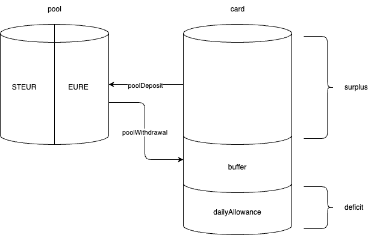

# RoboSaver

RoboSaver turns your Gnosis Pay card into an automated savings account!

Unused EURE on your card gets deposited into a liquidity pool, where it collects yield and swapping fees. As soon as your card's balance gets below a certain threshold, the RoboSaver will withdraw some EURE from the pool for you and top up your card. Thus creating the perfect balance between having EURE ready for spending and putting EURE to work!



## Technical Details

Only a single smart contract is needed; `RoboSaverVirtualModule`. The module is "virtual", since it doesn't get installed on the Gnosis Pay Safe directly, but on the `Delay` module instead. This way all of its transactions still respect the necessary delay needed to eventually settle with Visa.

### Proof of Concept

This PoC assumes that the safe has liquidity in the Balancer stEUR/EURE pool to begin with.

The `safeTopup` function exists to build the necessary calldata for the EURE withdrawal, and sends that payload to the delay module by passing it to `execTransactionFromModule`. After the cooldown has passed, `executeNextTx` can then be called (permissionlessly) on the delay module to actually execute it.

This process is then wrapped in the `checker` function; it either returns the payload necessary to call `safeTopup` or to call `executeNextTx`. A Gelato worker can then constantly poll `checker`, to know if it should top up the safe balance or execute a queued transaction.

### Live

This process can be observed to successfully work in the [TopupTest.t.sol](test/TopupTest.t.sol) test. We were also able to successfully run this onchain:

- `safeTopup` call to queue up the withdrawal: https://gnosisscan.io/tx/0x97fadc58880278486e505fc9706a7cfcf5e0e0405446d0912e457bb961e65763#eventlog
- `executeNextTx` call after the cooldown to actually withdraw: https://gnosisscan.io/tx/0x7852741c5b0e936703c5e0b3f69de368440ee1b1b54e2a8fd487f37fd743a68e

Note that the safe's EURE balance going below the threshold of 10 EURE triggered the Gelato worker to queue up the transaction automatically!


### Deployments

- `Roles`: https://gnosisscan.io/address/0xa7882cd617b53ac5832acceec0e786dbd38fec4b#code
- `Delay`: https://gnosisscan.io/address/0x60bea2e60ac91d354cad23391100bc24ebc9450e#code
- `Bouncer`: https://gnosisscan.io/address/0x40049dec4466fbdc52ec0c21c47c65a6315cf3e7#code
- `RoboSaverVirtualModule`: https://gnosisscan.io/address/0xe49c90547399f592e92dd28a149a448b17cf3b2a#code

## Installation

### Build

After cloning the repo, run `forge build` to initiate a compilation and fetch necessary dependencies.

Compilation of the contract at the end will raise some errors; this is because currently the `delay-module` requires a separate installation of dependencies. To fix this, run `yarn install --cwd lib/delay-module`.

Finally, copy `.env.example` to `.env` and populate it.

### Test

Run `forge test -vvvv`.

### Local Deployment

```
$ make startAnvil
```

```
$ make deployAnvil
```
